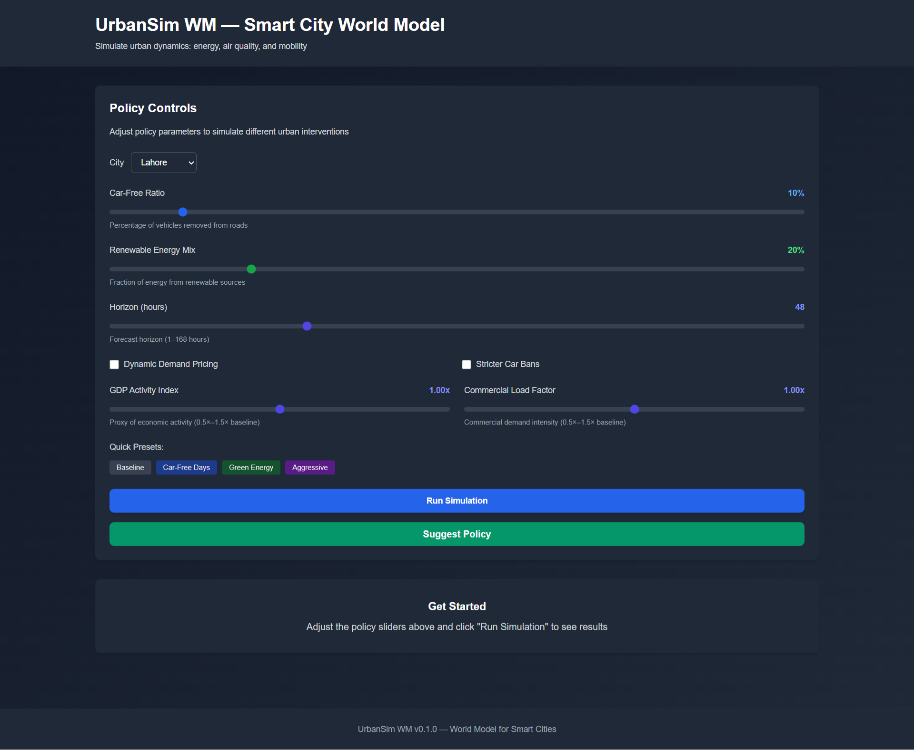
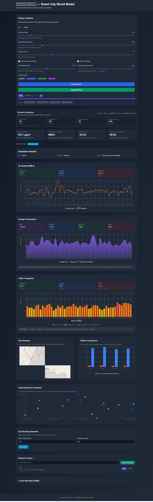

# UrbanSim WM — Smart City World Model

> **A generative world model for simulating and visualizing urban system dynamics**

UrbanSim WM enables policy experiments by predicting city-scale energy consumption, air quality, and mobility patterns. Built with a DreamerV3-style latent world model, it simulates counterfactual scenarios like car-free days or renewable energy transitions.

---

## Overview

UrbanSim WM combines machine learning with urban systems modeling to answer questions like:

- **What if we implement car-free days twice a week?**
- **How does renewable energy adoption affect air quality?**
- **What's the impact of combined policies on traffic and emissions?**

### Key Features

- **World Model**: DreamerV3-style recurrent state space model (RSSM) for temporal dynamics
- **Policy Simulation**: Interactive sliders to test urban interventions
- **Real-Time Visualization**: Charts for PM2.5, energy consumption, and traffic
- **Data Integration**: Connectors for OpenAQ, mobility datasets, and energy grids
- **Fully Dockerized**: One command to run the entire stack

---

## Architecture

```bash
┌─────────────────────────────────────┐
│   Next.js 14 Dashboard (Frontend)   │
│   - Policy sliders & visualizations │
└──────────────┬──────────────────────┘
               │ HTTP/REST
┌──────────────▼──────────────────────┐
│     FastAPI Backend (Python)        │
│   - /api/simulate endpoint          │
│   - Model inference wrapper         │
└──────────────┬──────────────────────┘
               │ Model Loading
┌──────────────▼──────────────────────┐
│   DreamerV3 World Model (PyTorch)   │
│   - Encoder → RSSM → Predictor      │
└──────────────┬──────────────────────┘
               │ Training Data
┌──────────────▼──────────────────────┐
│   ETL Data Pipelines                │
│   - WAQI (air quality, primary)     │
│   - OpenAQ (fallback)               │
│   - Mobility APIs                   │
│   - Energy grid data                │
└─────────────────────────────────────┘
```

### Visual Overview





---

## Quick Start

For a detailed, step-by-step guide with tips and troubleshooting, see the Quickstart:

- docs/QUICKSTART.md

For a deep-dive into what was implemented and why, see the Implementation Summary:

- docs/IMPLEMENTATION_SUMMARY.md

### More Documentation

- docs/CODEBASE_STATUS.md — Current component statuses and links
- docs/FUTURE_ROADMAP.md — Planned phases and milestones
- docs/MODEL_INFERENCE_FLOW.md — End-to-end data → model flow
- docs/AIR_QUALITY_DATA_SOURCES.md — Air quality sources (WAQI primary, alternatives)
- docs/ENERGY_DATA_SOURCES.md — Energy data options for Pakistan
- docs/MOBILITY_DATA_SOURCES.md — Mobility/traffic data options for Pakistan

### Prerequisites

- Docker & Docker Compose
- Make (optional, for convenience commands)
- 8GB+ RAM recommended

### 1. Clone the Repository

```bash
git clone <repository-url>
cd urbansim-wm
```

### 2. Configure Environment

```bash
cp .env.example .env
# Edit .env and add your API keys (optional for demo)
# Key variables (see .env.example):
# - WAQI_API_TOKEN=                # optional for real air quality
# - LOGS_DIR=./logs                # persisted logs (mounted in Docker)
# - PROCESSED_DATA_DIR=./etl/processed_data  # ETL outputs (mounted in Docker)
# - REDIS_URL=redis://redis:6379/0 # optional caching
```

### 3. Build and Run

```bash
# Using Make (recommended)
make build
make up

# Or using Docker Compose directly
docker-compose build
docker-compose up -d
```

### 4. Access the Application

- **Frontend Dashboard**: [http://localhost:3000](http://localhost:3000)
- **API Documentation**: [http://localhost:8000/docs](http://localhost:8000/docs)
- **API Health Check**: [http://localhost:8000/](http://localhost:8000/)

---

## Repository Structure

```bash
urbansim-wm/
├── backend/                 # FastAPI backend service
│   ├── app/
│   │   ├── main.py         # Application entry point
│   │   ├── api/            # API endpoints
│   │   │   ├── routes.py   # Route aggregation
│   │   │   ├── simulate.py # Simulation endpoint
│   │   │   └── retrain.py  # Retraining endpoint
│   │   ├── models/         # Model wrappers
│   │   ├── etl/            # ETL sources (WAQI primary, OpenAQ fallback)
│   │   └── core/           # Configuration
│   ├── requirements.txt
│   └── Dockerfile
│
├── training/               # Model training service
│   ├── urban_world_model.py # Training harness
│   ├── modules/
│   │   ├── encoder.py      # Observation encoder
│   │   ├── rssm.py         # Recurrent State Space Model
│   │   └── predictor.py    # Observation decoder
│   ├── configs/
│   │   └── base.yaml       # Training hyperparameters
│   ├── notebooks/          # Jupyter notebooks
│   └── checkpoints/        # Model checkpoints
│
├── frontend/               # Next.js 14 frontend
│   ├── app/                # App Router (Next.js 14)
│   │   ├── page.tsx        # Main simulator page
│   │   ├── layout.tsx      # Root layout
│   │   └── globals.css     # Global styles
│   ├── components/         # React components
│   │   ├── PolicyControls.tsx
│   │   ├── AirQualityChart.tsx
│   │   ├── EnergyChart.tsx
│   │   └── TrafficChart.tsx
│   ├── package.json
│   └── Dockerfile
│
├── docker-compose.yml      # Multi-service orchestration
├── Makefile               # Convenience commands
├── .env.example           # Environment template
└── README.md              # This file
```

---

## Development

### Available Make Commands

```bash
make help          # Show all available commands
make build         # Build all Docker containers
make up            # Start all services
make down          # Stop all services
make restart       # Restart all services
make train         # Run model training
make logs          # View logs from all services
make clean         # Remove containers and volumes
make etl           # Run data fetchers
```

### Running Services Individually

```bash
# Backend only
make backend
docker-compose logs -f backend

# Frontend only
make frontend
docker-compose logs -f frontend

# Training
make train
```

### Local Development (Without Docker)

```bash
# Install dependencies
make install

# Or manually:
cd backend && pip install -r requirements.txt
cd frontend && npm install
cd training && pip install -r requirements.txt

# Run backend
cd backend
uvicorn app.main:app --reload --host 0.0.0.0 --port 8000

# Run frontend
cd frontend
npm run dev

# Run training
cd training
python urban_world_model.py
```

---

## API Reference

### POST `/api/simulate`

Simulate urban dynamics under a policy scenario.

**Request Body:**

```json
{
  "city": "Lahore",
  "start_time": "2025-01-01T00:00:00Z",
  "horizon_hours": 48,
  "policy": {
    "car_free_ratio": 0.2,
    "renewable_mix": 0.35
  }
}
```

**Response:**

```json
{
  "city": "Lahore",
  "start": "2025-01-01T00:00:00Z",
  "horizon": 48,
  "policy": {
    "car_free_ratio": 0.2,
    "renewable_mix": 0.35
  },
  "simulated": [
    {
      "hour": 0,
      "pm25": 65.3,
      "energy_mwh": 1150.2,
      "traffic_index": 0.75
    },
    ...
  ],
  "meta": {
    "generated_at": 1704067200,
    "model_version": "v0.1.0"
  }
}
```

### GET `/api/health`

Health check endpoint.

---

### POST `/api/retrain`

Trigger background model retraining.

Request Body:

```json
{
  "config_path": "training/configs/base.yaml"
}
```

Response (example):

```json
{
  "status": "retrain_started",
  "job_id": "a1b2c3d4",
  "config": "training/configs/base.yaml",
  "logs": "training/logs/train_a1b2c3d4.log",
  "message": "Retraining job started in background"
}
```

Notes:

- Logs stream to `training/logs/train_<job_id>.log`.
- On success, latest checkpoints are copied to `training/checkpoints/latest.json` and `training/checkpoints/latest.pth`.

---

## Testing

```bash
# Run all tests (TODO: implement)
make test

# Or manually:
cd backend && pytest
cd frontend && npm test
```

---

## Data Sources

### Air Quality: WAQI (primary) and OpenAQ (fallback)

- Primary source: WAQI Feed API (`backend/app/etl/waqi.py`).
  - Configure `WAQI_API_TOKEN` in `.env` for live data.
  - Outputs JSON to `PROCESSED_DATA_DIR` (default `./etl/processed_data`).
  - Includes real-time PM2.5, forecast stats, min/max, and timestamps.
- Fallback: OpenAQ v3 (`backend/app/etl/openaq.py`).
  - Robust sensor mean with outlier guards and request backoff.

Other planned integrations:

- Mobility: TomTom/HERE
- Energy: EIA/ENTSO‑E or city providers
- Weather: OpenWeather or NOAA

---

## Model Architecture

### DreamerV3-Style World Model

1. **Encoder**: Maps multi-modal observations (PM2.5, energy, traffic) to latent embeddings
2. **RSSM (Recurrent State Space Model)**: Learns temporal dynamics
   - Deterministic state (GRU): Captures sequential patterns
   - Stochastic state (VAE): Models uncertainty
3. **Predictor**: Decodes latent states back to observations

📖 **For a complete deep dive into the DreamerV3 implementation**, see [`docs/DREAMERV3_IMPLEMENTATION.md`](docs/DREAMERV3_IMPLEMENTATION.md). This document covers:
- Architecture details (Encoder, RSSM, Predictor)
- Training process and techniques (KL annealing, gradient clipping, LR scheduling)
- Inference flow (from ETL data to predictions)
- Code locations and how everything works together

### Training Process

```bash
# Run training container
make train

# Or with custom config
docker-compose --profile training run --rm training python urban_world_model.py
```

Training hyperparameters are in `training/configs/base.yaml`.

Training loop includes dataset loading, validation, checkpointing, KL annealing, gradient clipping, LR scheduling, and TensorBoard logging.

---

## Customization

### Adding New Data Sources

1. Create a new fetcher in `etl/`
2. Update `training/urban_world_model.py` to load the data
3. Modify encoder input dimensions in `training/configs/base.yaml`

### Extending the Model

- Encoder: `training/modules/encoder.py`
- RSSM: `training/modules/rssm.py`
- Predictor: `training/modules/predictor.py`

### Frontend Customization

- Add new charts in `frontend/components/`
- Modify policy controls in `frontend/components/PolicyControls.tsx`
- Tailwind styling is mobile-responsive. Adjust global styles in `frontend/app/globals.css`.
- API calls use relative paths (`/api/...`) with Next.js rewrites for Docker.

---

## Troubleshooting

### Backend not starting

```bash
docker-compose logs backend
# Check for missing environment variables or port conflicts
```

### Frontend can't connect to backend

- In Docker, frontend uses relative paths and Next.js rewrites; ensure the backend service is named `backend` and healthy: `curl http://backend:8000/` from within the container.
- On host, open `http://localhost:3000` and verify network tab calls are proxied to the backend.

### ETL outputs and logs not visible

- Logs: check mounted directory specified by `LOGS_DIR` (default `./logs`).
- ETL outputs: check `PROCESSED_DATA_DIR` (default `./etl/processed_data`).
- Ensure volumes are mounted in `docker-compose.yml` (e.g., `./logs:/logs`, `./etl/processed_data:/etl/processed_data`).

### Docker build errors

```bash
# Clean rebuild
make clean
make build
```

---

## Future Roadmap

Full roadmap is maintained in `docs/FUTURE_ROADMAP.md`. Highlights:

### Phase 2: Next (Beta)

- Real mobility data integration (Google CSV → TomTom/HERE) [see docs/MOBILITY_DATA_SOURCES.md]
- Real energy data integration (NTDC/NEPRA reports → EIA proxies) [see docs/ENERGY_DATA_SOURCES.md]
- ETL caching/optimization (Redis)
- Input validation polish for `/api/simulate`
- UI scenario comparison and export (CSV/JSON)
- Initial test scaffolding (backend & frontend)

### Phase 3: Production

- Multi-source data aggregation across AQ/Mobility/Energy [see docs/AIR_QUALITY_DATA_SOURCES.md, docs/MOBILITY_DATA_SOURCES.md, docs/ENERGY_DATA_SOURCES.md]
- Advanced explainability from model internals
- CI/CD pipeline and observability (metrics, traces)
- Broader test suite (unit, integration, e2e)
- Performance optimization and caching for inference
- Optional: TorchServe/gRPC; AuthN/Z; spatial maps and district overlays

---

## 🤝 Contributing

Contributions are welcome! Please:

1. Fork the repository
2. Create a feature branch (`git checkout -b feature/amazing-feature`)
3. Commit your changes (`git commit -m 'Add amazing feature'`)
4. Push to the branch (`git push origin feature/amazing-feature`)
5. Open a Pull Request

---

## 📄 License

This project is licensed under the MIT License - see the [LICENSE](LICENSE) file for details.

---

## 🙏 Acknowledgments

- **DreamerV3**: Hafner et al. (2023) - "Mastering Diverse Domains through World Models"
- **WAQI**: Real-time air quality feed
- **OpenAQ**: Open air quality data for all (fallback)
- **FastAPI**: Modern, fast web framework for Python
- **Next.js**: React framework for production
- **Recharts**: Composable charting library

---

## 📧 Contact

For questions or support, please open an issue on GitHub.

Maintainer:

- Adnan Sattar — [LinkedIn](https://www.linkedin.com/in/adnansattar/)

---

**Built with ❤️ for smarter, more sustainable cities**
